<h1 align="center">Dossier</h1>

<p align="center">
  <b>One JSON model in. One self-contained HTML page out.</b><br>
  An agent writes the model, a person reads the page once and decides by number,<br>
  and the agent reads the decisions back.
</p>

<p align="center">
  <a href="https://github.com/kylebegeman/dossier/releases/latest"></a>
  <a href="https://www.npmjs.com/package/@kylebegeman/dossier"></a>
  <a href="https://github.com/kylebegeman/dossier/actions/workflows/core.yml"></a>
  <a href="LICENSE"></a>
</p>

<p align="center">
  <a href="https://kylebegeman.github.io/dossier/"><b>Open the live examples</b></a>
  &nbsp;·&nbsp; <a href="#install">Install</a>
  &nbsp;·&nbsp; <a href="#how-it-works">How it works</a>
  &nbsp;·&nbsp; <a href="#hand-it-to-your-agent">For agents</a>
</p>

<picture>
  <source media="(prefers-color-scheme: dark)" srcset="docs/assets/readme/hero-dark.webp">
  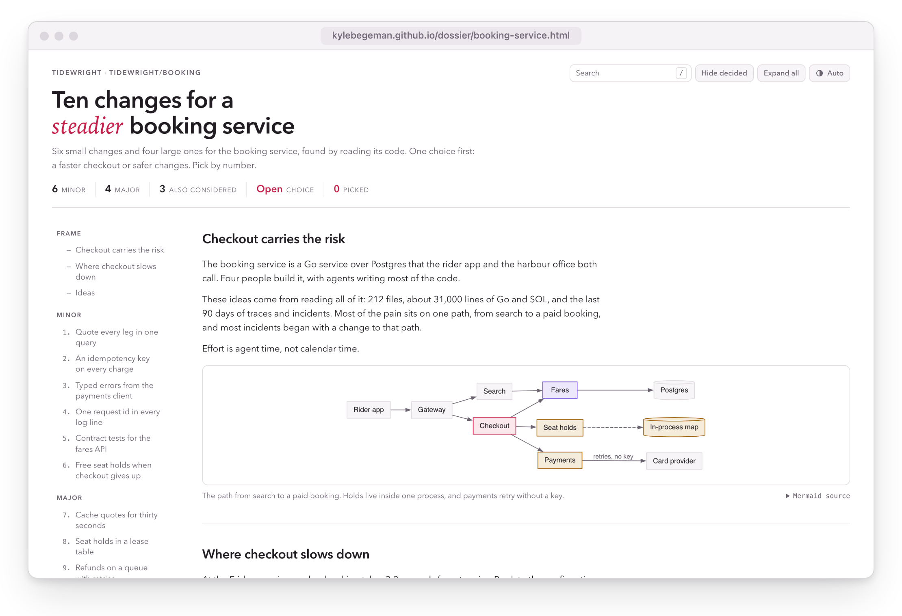
</picture>

## Why Dossier

- **A page people actually read.** Detail sits behind a fold, a contents rail follows along, and search, summary tables, and dark mode come built in.
- **Decisions, not comment threads.** Readers pick ideas or rule on findings by number, and the page writes one reply line as they go.
- **Made for agents.** The model travels inside the page as JSON, and one binary gives agents a CLI, an MCP server, and a skill.
- **Nothing to host.** Every page is one file that makes no external requests, so it works as an attachment, a CI artifact, or a static site.

## How it works

<picture>
  <source media="(prefers-color-scheme: dark)" srcset="docs/assets/readme/loop-dark.webp">
  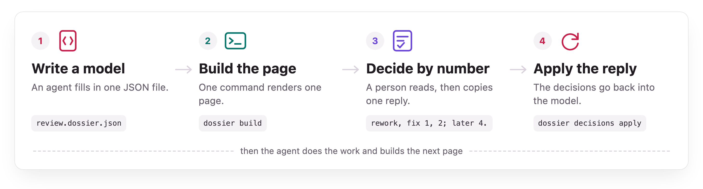
</picture>

Start from a kind, fill it in, and build the page:

```sh
dossier init review --title "Tide-aware cancellations"
dossier validate tide-aware-cancellations.dossier.json
dossier build tide-aware-cancellations.dossier.json
```

The reader opens `tide-aware-cancellations.html`, decides, and copies the reply. The agent writes it back into the model:

```sh
dossier decisions apply tide-aware-cancellations.dossier.json --reply "rework, fix 1, 2; later 4."
```

<details>
<summary><b>What a model looks like</b></summary>

<br>

```json
{
  "dossier": "1.0",
  "kind": "review",
  "meta": { "title": "Tide-aware cancellations", "slug": "tide-aware-cancellations" },
  "sections": [
    {
      "id": "scope",
      "title": "Scope",
      "parts": [{ "type": "prose", "markdown": "Joss's change at revision `4e1c9a2`, with the tests run locally." }]
    },
    {
      "id": "findings",
      "title": "Findings",
      "board": {
        "summary": true,
        "items": [
          {
            "id": "utc-tides",
            "title": "Tide times compared in UTC against local sailing times",
            "summary": "Sailing times are local and tide times are UTC, so in summer time every check looks at the wrong hour.",
            "severity": "blocker",
            "effort": "S",
            "facets": [
              { "label": "Where", "markdown": "`booking/tide/window.go`, line 58, in `depthAt`." },
              { "label": "Why it matters", "markdown": "From March to October the job reads the depth an hour away from departure." }
            ]
          }
        ]
      }
    }
  ]
}
```

That model builds as it stands. The full document is [core/examples/tide-aware-cancellations.dossier.json](core/examples/tide-aware-cancellations.dossier.json).

</details>

## Decide by number

<picture>
  <source media="(prefers-color-scheme: dark)" srcset="docs/assets/readme/decide-dark.gif">
  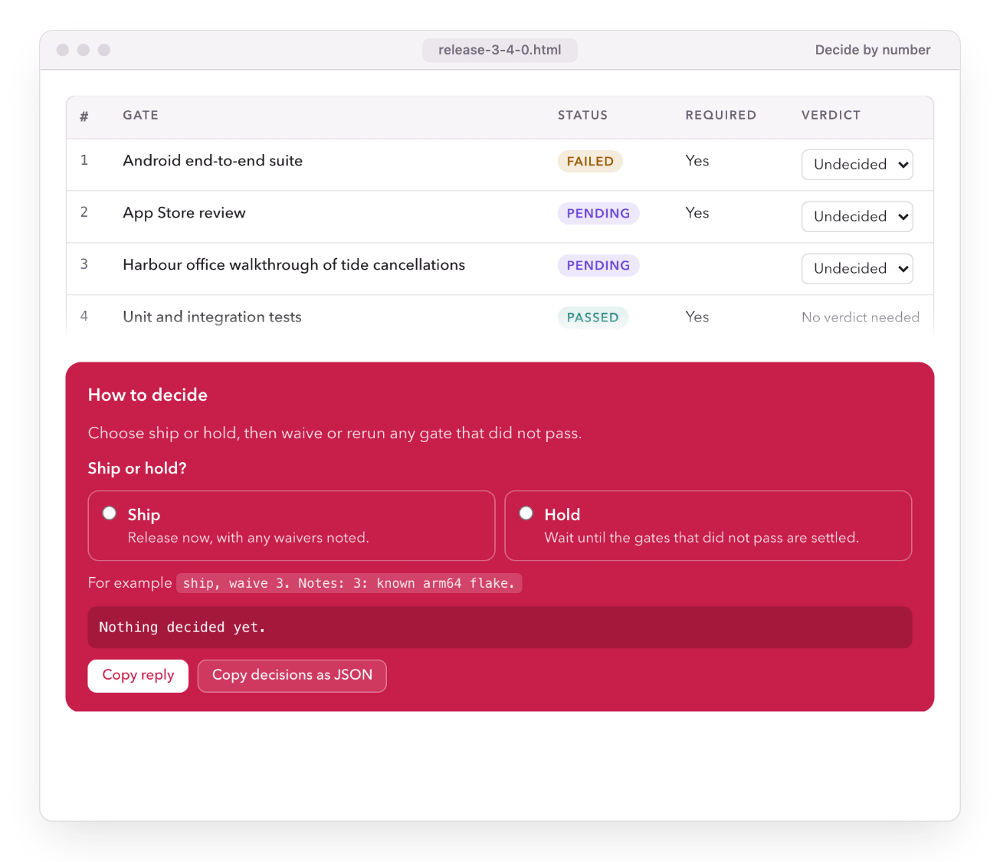
</picture>

Each kind decides its own way, and every decision comes back as one line an agent can apply.

| Kind | Items | The reader decides | A reply |
| --- | --- | --- | --- |
| `brainstorm` | ideas | Picks, after an optional choice | `storms, 1, 7, 10.` |
| `plan` | steps | Go, revise, or skip | `go 1-4; revise 5; skip 7.` |
| `review` | findings | Approve or rework, then fix, later, or skip | `rework, fix 1, 2; later 4.` |
| `release` | gates | Ship or hold, then waive or rerun | `ship, waive 1; rerun 2.` |
| `incident` | follow-ups | Do, later, or skip | `do 1, 3, 5, 6; later 4.` |
| `brief` | findings | Nothing: a brief is read, not decided | |

## Six kinds, one team

The showcase follows Tidewright, an invented four-person team running ferry tickets for the Wenlow Islands. Every page opens live.

### Brainstorm: [Ten moves for a calmer winter crossing](https://kylebegeman.github.io/dossier/winter-crossing.html)

Ideas grouped by size and picked by number, with a choice to make first.

<a href="https://kylebegeman.github.io/dossier/winter-crossing.html">
<picture>
  <source media="(prefers-color-scheme: dark)" srcset="docs/assets/readme/kind-brainstorm-dark.webp">
  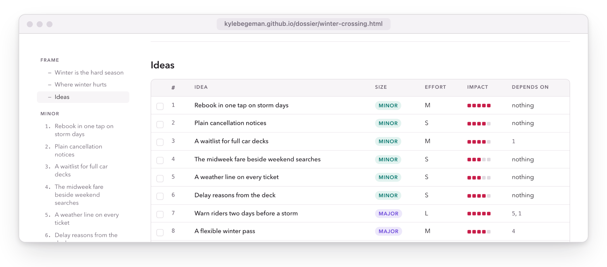
</picture>
</a>

### Plan: [Offline boarding passes](https://kylebegeman.github.io/dossier/offline-boarding-passes.html)

Steps in phase boards with statuses and owners, a Mermaid diagram, and go, revise, or skip.

<a href="https://kylebegeman.github.io/dossier/offline-boarding-passes.html">
<picture>
  <source media="(prefers-color-scheme: dark)" srcset="docs/assets/readme/kind-plan-dark.webp">
  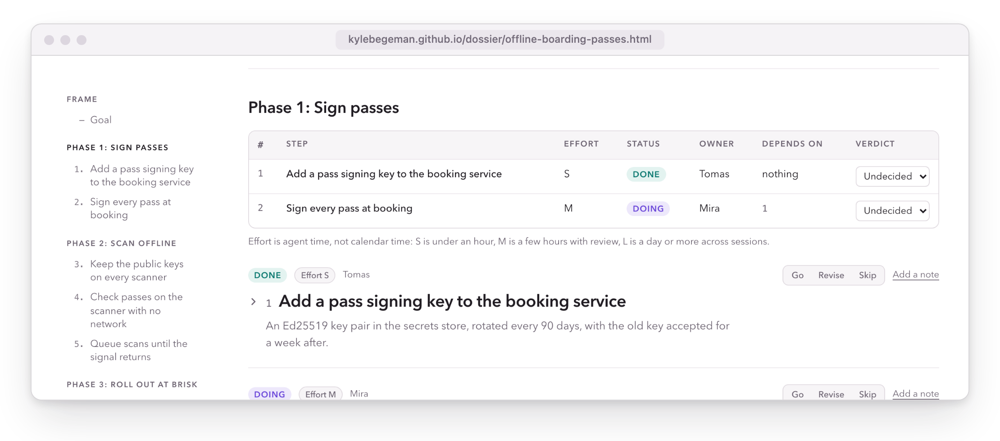
</picture>
</a>

### Review: [Tide-aware cancellations](https://kylebegeman.github.io/dossier/tide-aware-cancellations.html)

Findings by severity, verdicts from the keyboard, and approve or rework.

<a href="https://kylebegeman.github.io/dossier/tide-aware-cancellations.html">
<picture>
  <source media="(prefers-color-scheme: dark)" srcset="docs/assets/readme/kind-review-dark.webp">
  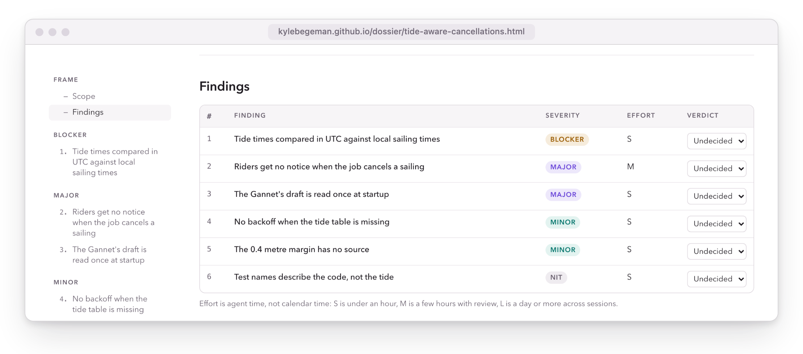
</picture>
</a>

### Release: [Release 3.4.0](https://kylebegeman.github.io/dossier/release-3-4-0.html)

Gates to waive or rerun, and a warning when shipping over a failed one.

<a href="https://kylebegeman.github.io/dossier/release-3-4-0.html">
<picture>
  <source media="(prefers-color-scheme: dark)" srcset="docs/assets/readme/kind-release-dark.webp">
  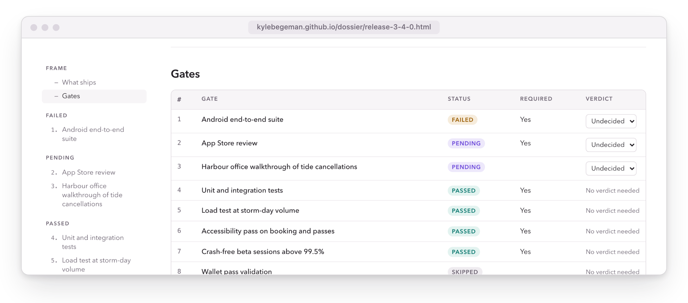
</picture>
</a>

### Incident: [Double-booked car deck on the 07:40](https://kylebegeman.github.io/dossier/car-deck-double-booking.html)

Severity facts, a timeline, contributing factors, and follow-ups to commit to.

<a href="https://kylebegeman.github.io/dossier/car-deck-double-booking.html">
<picture>
  <source media="(prefers-color-scheme: dark)" srcset="docs/assets/readme/kind-incident-dark.webp">
  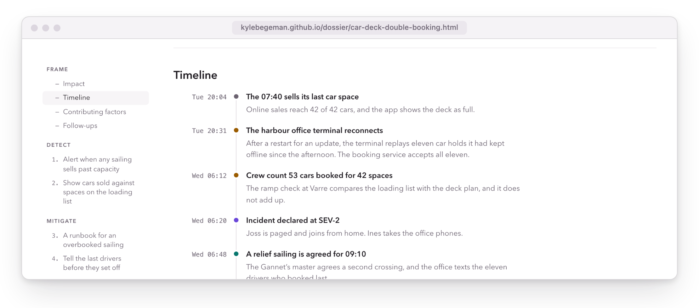
</picture>
</a>

### Brief: [Why riders abandon checkout](https://kylebegeman.github.io/dossier/checkout-abandonment.html)

Findings by confidence, a chart, and a figure, in a custom blue, with nothing to decide.

<a href="https://kylebegeman.github.io/dossier/checkout-abandonment.html">
<picture>
  <source media="(prefers-color-scheme: dark)" srcset="docs/assets/readme/kind-brief-dark.webp">
  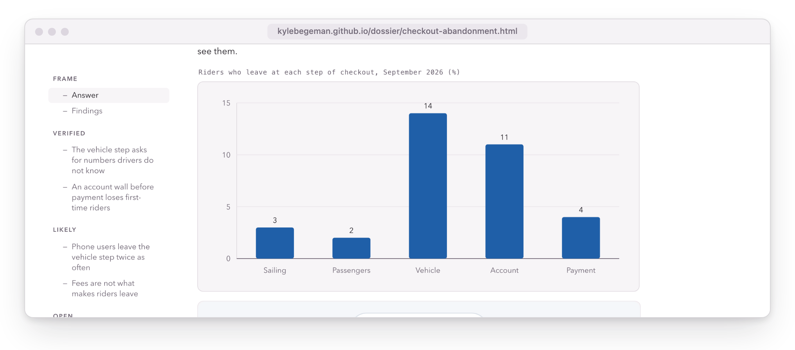
</picture>
</a>

## Everything on the page

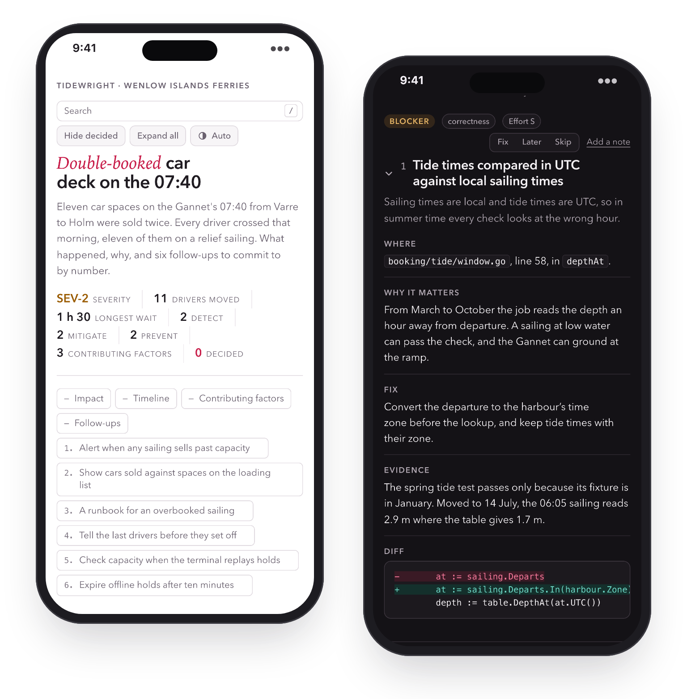

- **Search.** Press `/`, and every hit is highlighted. Enter steps through them.
- **Keyboard verdicts.** Arrow keys move and select, and Delete clears.
- **Hide decided.** Narrow the page to what is still open.
- **Parts that carry weight.** Tables, specs, callouts, highlighted code, figures, charts, timelines, and diagrams from DOT or Mermaid, laid out as SVG at build time.
- **One brand color.** Set `meta.theme.accent`, and the light and dark variants stay readable.
- **Phones, dark mode, and print.** The same file works everywhere.
- **The model inside.** Agents read the embedded JSON instead of scraping the page.
- **Markdown too.** `dossier build --md` writes a copy for pull requests and wikis.

<br clear="right">

## The studio

<picture>
  <source media="(prefers-color-scheme: dark)" srcset="docs/assets/readme/studio-dark.webp">
  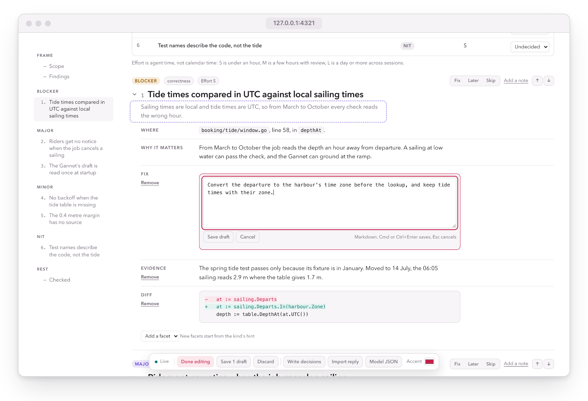
</picture>

```sh
dossier serve tide-aware-cancellations.dossier.json --open
```

- **Edit in place.** Click any text, change it, and keep it as a draft until you save.
- **Shape items.** Add or remove facets from the kind's vocabulary, and reorder items.
- **Decide together.** Choices, verdicts, and notes live in SQLite beside the model, in step across tabs.
- **Take replies back.** Paste the reply someone sent, then write the decisions into the model.
- **Edit the JSON.** A CodeMirror editor validates before every save and marks each finding where it occurs.
- **Try a color.** Preview an accent in both themes, then keep it in the model.

None of it ships in the built page.

## Install

```sh
brew install kylebegeman/tap/dossier
```

```sh
npm install --save-dev @kylebegeman/dossier
```

Or download an archive for macOS, Linux, or Windows from the [latest release](https://github.com/kylebegeman/dossier/releases/latest), or build it with Go: `cd core && make build`.

## Hand it to your agent

```sh
dossier skill --write ~/.claude/skills/dossier/SKILL.md
```

```sh
claude mcp add dossier -- dossier mcp
```

The skill and the MCP server come from one command catalog, so they always match the binary you run. Any MCP client can run `dossier mcp` over stdio.

| Command | What it does |
| --- | --- |
| `dossier init KIND` | Write a starter model with the kind's sections and facets |
| `dossier validate FILES...` | Check models against the schema, the structure rules, and their kind |
| `dossier build FILES... [--md]` | Render pages, with Markdown when asked |
| `dossier decisions apply MODEL --reply "..."` | Write a reader's reply into the model |
| `dossier decisions read MODEL` | Print the decisions for the next step |
| `dossier serve MODEL` | Run the studio |
| `dossier upgrade FILES...` | Rewrite 0.6 documents as 0.7 models |
| `dossier describe` | List every command and kind |

## More

**React.** [`@kylebegeman/dossier-react`](packages/react) renders a model on the server and shows the page in a sandboxed frame that sizes itself and reports the reader's decisions, verdicts included.

**Custom kinds.** Write one `*.kind.json` file per kind, starting from a preset that `dossier describe --json` prints, and pass `--kinds DIR` to any command. [`retro.kind.json`](core/examples/kinds/retro.kind.json) is a worked example.

**Coming from 0.6.** 0.6 documents still validate and build, with a warning for each old block, and `dossier upgrade FILE` rewrites them onto the new kinds. The 0.6 npm package's JavaScript API is gone; `@kylebegeman/dossier@0.6.7` stays on npm.

**Releases.** Each release attaches its own release document, built with Dossier.

## Develop

```sh
cd core
make check       # generated-code drift, gofmt, vet, staticcheck, errcheck, race tests, a CGO-free build
make dist-check  # cross-compile every target and dry-run the archives, npm packages, and Homebrew formula
make site        # build the showcase into ../site
```

Agents start at [core/AGENTS.md](core/AGENTS.md). Pushing a version tag runs [the release workflow](.github/workflows/release.yml).

## License

[MIT](LICENSE)
