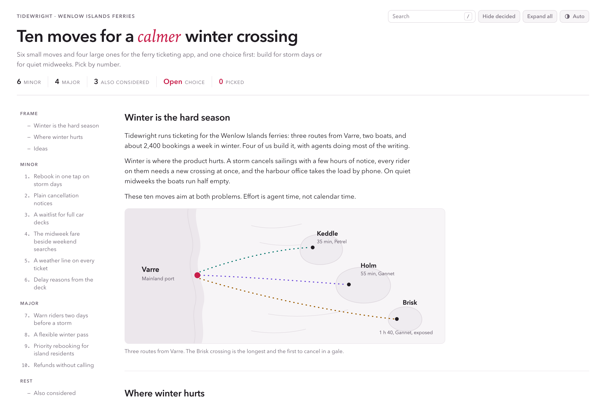
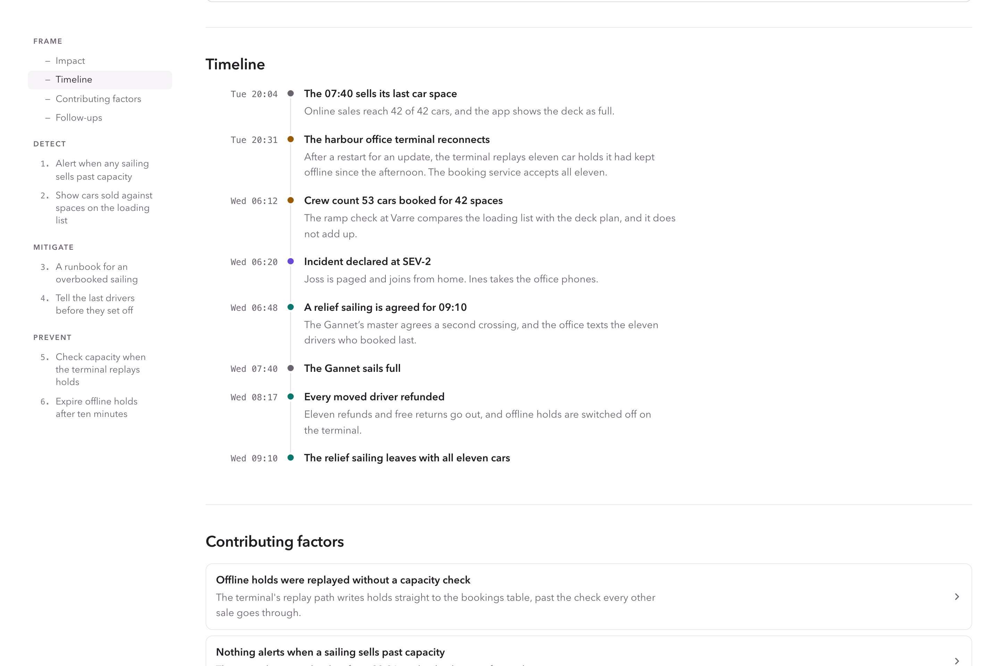

# Dossier

One JSON model in, one self-contained HTML page out. An agent writes the
model, a person reads the page once and decides by number, and the agent reads
the decisions back.

> Brainstorm small and large moves for a calmer winter on our ferry ticketing app, as a dossier I can pick from by number. Ask me first whether winter should build for storm days or quiet midweeks.

<picture>
  <source media="(prefers-color-scheme: dark)" srcset="docs/assets/dossier-0-7-dark.png">
  
</picture>

## Install

```sh
brew install kylebegeman/tap/dossier
```

```sh
npm install --save-dev @kylebegeman/dossier
```

Or build it from this repository with Go: `cd core && make build` writes
`core/bin/dossier`, one static binary with no runtime dependencies.

## Hand it to your agent

The binary carries its own skill and its own MCP server, both generated from
one command catalog, so they always match the version you run.

```sh
dossier skill --write ~/.claude/skills/dossier/SKILL.md
```

```sh
claude mcp add dossier -- dossier mcp
```

Any other MCP client runs `dossier mcp` over stdio.

## The loop

1. `dossier init brainstorm --title "Onboarding ideas"` writes a starter model
   with the kind's facets in place.
2. The agent fills it in and runs `dossier validate`. Findings block the
   build. Warnings, such as a summary past its length, are advice.
3. `dossier build onboarding-ideas.dossier.json` writes one HTML file beside
   the model.
4. The reader skims, searches, opens what matters, decides, and copies a
   reply such as `1, 3, 4. Notes: 3: keep blue.`
5. `dossier decisions apply onboarding-ideas.dossier.json --reply "1, 3, 4"`
   writes the decisions into the model for the next step.

`dossier describe` lists every command, and the generated
[skill](core/skill/SKILL.md) documents each one with its parameters.

## Six kinds

Each kind decides what its items are, the fields and facets they carry, the
sections a document should have, and how a reader decides. The examples in
[core/examples](core/examples) are one team's documents, and every one of them
is a test fixture that builds with no warnings.

| Kind | Example | The reader decides |
| --- | --- | --- |
| `brainstorm` | Ten moves for a calmer winter crossing, and Small fixes before the spring timetable | By picking numbers, with an optional choice first |
| `plan` | Offline boarding passes | Go, revise, or skip for each step |
| `review` | Tide-aware cancellations | Approve or rework, then fix, later, or skip for each finding |
| `release` | Release 3.4.0 | Ship or hold, then waive or rerun each gate that did not pass |
| `incident` | Double-booked car deck on the 07:40 | Do, later, or skip for each follow-up |
| `brief` | Why riders abandon checkout | Nothing: a brief is read, not decided |



A team adds its own kinds as `*.kind.json` files and passes `--kinds DIR` to
any command.

## What a model holds

- **Kind** names one of the kinds above or a custom one.
- **Section** has a title and either content parts or a board. Parts are
  prose, spec, table, callout, code, figure, diagram, chart, and timeline.
- **Item** is a thing on a board, with a one-sentence summary, the fields its
  kind declares, and facets.
- **Facet** is a labeled Markdown body on an item, in the kind's order.
- **Decisions** are the only state: the choice, picks or verdicts by item
  number, and notes.

Effort is agent time, never calendar time: `S` is under an hour, `M` a few
hours with review, `L` a day or more across sessions.

## The page

- One file that makes no external requests. Web fonts are opt-in.
- A reader runtime under 20 KB and a stylesheet under 30 KB, held there by
  tests.
- Light and dark themes, one brand color from `meta.theme.accent`, a
  contents rail, search, collapsed items, summary tables, and print styles.
- Decision controls that work from the keyboard, and a decision block that
  writes the reply as the reader goes and warns when a choice runs past
  something the kind guards, such as shipping over a failed required gate.
- Diagrams written in DOT or as Mermaid flowcharts, laid out as SVG at build
  time, alongside charts, inlined figures, and timelines.
- The model rides along as a JSON island, so an agent reads one element
  instead of scraping the page. `dossier build --md` also writes a Markdown
  rendition for a pull request or a wiki.

## The studio

```sh
dossier serve onboarding-ideas.dossier.json --open
```

A local studio for the same page: live reload when the file changes, click to
edit any text as a draft, add or remove facets, reorder items, and keep the
choice, picks, verdicts, and notes in a SQLite store beside the model, in step
across open tabs. Paste a reply someone sent back to import it, edit the model
as JSON in an editor that marks each finding where it occurs, and preview an
accent color before keeping it in the model. None of it ships in the built
file.

## React

[`@kylebegeman/dossier-react`](packages/react) renders a model on the server
and shows the page in a sandboxed frame that sizes itself and reports the
reader's decisions. Its model types are generated from the same JSON Schema the
binary validates with.

## Coming from 0.6

0.6 model files still validate and build, with a deprecation warning for each
old block. `dossier upgrade FILE` writes them as 0.7 models, with each old
block family mapped onto its kind's fields and facets. 0.8 removes the
aliases.

## Develop

```sh
cd core
make check
```

`make check` regenerates and drift-checks the generated code, then runs gofmt,
vet, staticcheck, errcheck, the race-enabled tests, and a CGO-free build.
`make dist-check` cross-compiles every target and dry-runs the archives, the
npm packages, and the Homebrew formula without publishing anything. Agents
start at [core/AGENTS.md](core/AGENTS.md).

## License

[MIT](LICENSE)
