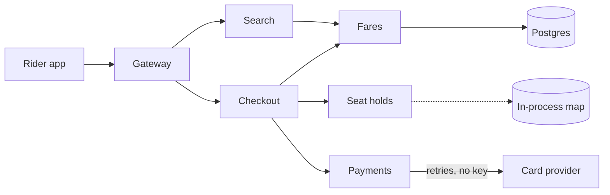

# Ten changes for a steadier booking service

*Tidewright · tidewright/booking*

Six small changes and four large ones for the booking service, found by reading its code. One choice first: a faster checkout or safer changes. Pick by number.

**6** minor · **4** major · **3** also considered · **Open** choice · **0** picked

2026-09-16 · for-decision

## Checkout carries the risk

The booking service is a Go service over Postgres that the rider app and the harbour office both call. Four people build it, with agents writing most of the code.

These ideas come from reading all of it: 212 files, about 31,000 lines of Go and SQL, and the last 90 days of traces and incidents. Most of the pain sits on one path, from search to a paid booking, and most incidents began with a change to that path.

Effort is agent time, not calendar time.

**The path from search to a paid booking. Holds live inside one process, and payments retry without a key.**



## Where checkout slows down

At the Friday evening peak, a booking takes 3.2 seconds from tapping Book to the confirmation, and one attempt in forty times out. Payments and fares account for most of the wait.

**Median milliseconds per checkout step, Friday evening peak**

|  | Value |
| --- | --- |
| Search | 240 |
| Fares | 720 |
| Hold | 380 |
| Payment | 1640 |
| Confirm | 220 |

**fares/quote.go: one query for every leg of the trip**

```go
func (q *Quoter) Quote(ctx context.Context, legs []Leg) (Quote, error) {
	var total Money
	for _, leg := range legs {
		fare, err := q.store.FareFor(ctx, leg.RouteID, leg.Class)
		if err != nil {
			return Quote{}, err
		}
		total = total.Add(fare.Price(leg.Party))
	}
	return Quote{Total: total}, nil
}
```

- **3.2 seconds**: Median from Book to the confirmation at the Friday peak.
- **1 in 40**: Checkout attempts that time out at the same peak.
- **7 of 11**: Incidents in 90 days that began with a change to checkout.
- **No tests**: Cover the payment retry path or the seat hold expiry.

> **A retry can charge twice**
>
> When the card provider is slow, checkout retries the charge without an idempotency key. Twice in 90 days a rider paid twice for one booking. Idea 2 closes this whichever way the cycle goes.

## Ideas

| # | Idea | Size | Effort | Impact | Depends on |
| --- | --- | --- | --- | --- | --- |
| 1 | Quote every leg in one query | minor | S | 4/5 |  |
| 2 | An idempotency key on every charge | minor | S | 5/5 |  |
| 3 | Typed errors from the payments client | minor | S | 3/5 |  |
| 4 | One request id in every log line | minor | S | 3/5 |  |
| 5 | Contract tests for the fares API | minor | M | 3/5 |  |
| 6 | Free seat holds when checkout gives up | minor | S | 3/5 |  |
| 7 | Cache quotes for thirty seconds | major | M | 4/5 | 1 |
| 8 | Seat holds in a lease table | major | L | 5/5 |  |
| 9 | Refunds on a queue with retries | major | L | 4/5 | 2, 3 |
| 10 | Ship checkout changes behind flags | major | M | 4/5 |  |

*Effort is agent time, not calendar time: S is under an hour, M is a few hours with review, L is a day or more across sessions.*

### 1. Quote every leg in one query

minor · Effort S · Impact 4/5

Fares for a whole trip load in one query instead of one per leg, which removes most of the wait in the fares step.

#### How it works

`FareFor` becomes `FaresFor` in `fares/store.go`, and `Quote` reads from the map it returns:

```postgresql
SELECT route_id, class, price FROM fares
WHERE (route_id, class) IN (SELECT * FROM unnest($1::text[], $2::text[]))
```

#### Why

Fares is the second slowest step, and almost all of it is round trips. A return trip for a family of four makes eight queries today.

#### In use

The trace for a return booking shows one fares query, and the step drops to about 90 ms.

#### Unlocks

Idea 7 caches the same map.

### 2. An idempotency key on every charge

minor · Effort S · Impact 5/5

Each checkout sends one key with its charge and every retry, so a slow card provider can never charge a rider twice.

#### How it works

Checkout makes one key for each payment, stores it on the booking row, and `payments/charge.go` sends it as `Idempotency-Key` on the first call and on every retry.

#### Why

Two riders were charged twice in 90 days, both after a provider timeout, and each refund took the harbour office 25 minutes.

#### Unlocks

Idea 9 reuses the key to refund exactly once.

#### Risk

A key kept only in memory is lost on a restart mid-checkout, which is why it lives on the booking row.

### 3. Typed errors from the payments client

minor · Effort S · Impact 3/5

The payments client returns declined, retryable, and fatal errors as values the caller can test, not messages it has to match.

#### How it works

`payments/client.go` wraps provider codes in `ErrDeclined`, `ErrRetryable`, and `ErrFatal`. Checkout switches on `errors.Is` instead of `strings.Contains(err.Error(), "timeout")`.

#### Why

Three incidents started when the provider reworded an error message. With types, the compiler and the tests catch that instead of riders.

#### Unlocks

Ideas 2 and 9 retry only `ErrRetryable`.

### 4. One request id in every log line

minor · Effort S · Impact 3/5

A request id from the gateway reaches every log line and outgoing call, so one checkout reads as one story.

#### How it works

Middleware in `api/middleware.go` puts the id in the context, `internal/log` adds it to every line, and the fares and payments clients forward it as `X-Request-Id`.

#### Why

Following a failed checkout today means matching timestamps across four logs. It took two hours in the last incident.

#### In use

Searching the logs for one id shows the whole booking, from search to the card provider's answer.

### 5. Contract tests for the fares API

minor · Effort M · Impact 3/5

Recorded app requests pin what the rider app expects from the fares endpoint, so CI fails before a change breaks the app.

#### How it works

`fares/contract_test.go` replays the app's recorded requests from `testdata/app-fares/` against the handler and compares every response field by name and type.

#### Why

Two releases broke the app by renaming a fares field, and both passed every test the service had.

#### Note

The app team records new requests with one command when the app changes.

### 6. Free seat holds when checkout gives up

minor · Effort S · Impact 3/5

A failed or abandoned checkout frees its held spaces at once instead of waiting fifteen minutes for them to expire.

#### How it works

Checkout's error path and the app's back button call `holds.Release`. Expiry stays as the backstop for a rider who closes the app.

#### Why

At the peak, abandoned holds keep up to 30 car spaces off sale, and riders see a sailing as full when it is not.

### 7. Cache quotes for thirty seconds

major · Effort M · Impact 4/5 · Depends on 1

Search, the trip screen, and checkout share one short-lived quote, so a rider's fare is worked out once per trip.

#### How it works

`fares/cache.go` keys quotes by route, date, class, and party, keeps them for 30 seconds, and drops them all when fares change by bumping a version.

#### Why

A rider sees the same quote on three screens, and each screen asks for it again. At the peak that is a third of all fares queries.

#### Risk

A stale price must never reach payment. Checkout checks the fares version again before it charges and requotes if it moved.

### 8. Seat holds in a lease table

major · Effort L · Impact 5/5

Holds move from a map inside one process to a Postgres table, so deploys keep them and two instances can take bookings.

#### How it works

A `hold_leases` table with a unique index on sailing and space. Holds are taken with `INSERT ... ON CONFLICT DO NOTHING` and swept when they expire, and `holds/holds.go` keeps its interface.

#### Why

Holds live in memory today, so the service cannot run a second instance, and every deploy drops the holds of riders mid-checkout.

#### In use

A deploy at the Friday peak goes unnoticed, and the gateway spreads checkouts across two instances.

#### Unlocks

A second instance at the Friday peak, which halves the queue in front of every checkout step.

#### Risk

A mistake here double books car spaces. Run both stores side by side for a week and compare every hold before switching.

### 9. Refunds on a queue with retries

major · Effort L · Impact 4/5 · Depends on 2, 3

Refunds leave the request path for a worker that retries with backoff and records every attempt.

#### How it works

Cancelling a booking writes a `refund_jobs` row. A worker in `refunds/worker.go` sends it with the charge's key and retries `ErrRetryable` with backoff.

#### Why

A slow refund holds the cancel screen for up to 20 seconds today, and a failed one is lost unless the rider calls.

#### Risk

A stuck queue delays refunds without a sound. Alert when the oldest job is more than ten minutes old.

### 10. Ship checkout changes behind flags

major · Effort M · Impact 4/5

A checkout change can go out switched off, reach a share of riders, and be turned off again without a rollback.

#### How it works

A small flag store in `internal/flags`, read from Postgres every 30 seconds and checked in `checkout/handler.go`, plus a `flags` command for the team.

#### Why

Seven of the last eleven incidents began with a checkout change, and each one took a full rollback to undo.

#### In use

A new payment screen reaches 5% of riders on Monday, half on Wednesday, and everyone once its error rate holds.

#### Risk

Old flags pile up. Each flag gets an owner and a removal date when it is added.

## Also considered

- **Rewrite checkout in Rust**\
  The time goes to round trips and the card provider, not to Go, so a rewrite would move none of it.
- **Split booking into microservices**\
  Four people run this, and more services would add the very network hops that slow checkout.
- **A GraphQL gateway for the apps**\
  The app's calls are few and cheap, and idea 7 removes the repeated ones.

## How to pick

Reply with the numbers you want, plus notes on anything to change.

**Where should this cycle start?**

- `speed` **A faster checkout**: Cut the round trips and slow calls riders wait through at the Friday peak.
- `safety` **Safer changes**: Tests, flags, and clear errors, so a change stops breaking checkout.

For example: `speed, 2, 5, 7. Notes: 5: smaller first.`

No decisions yet.
