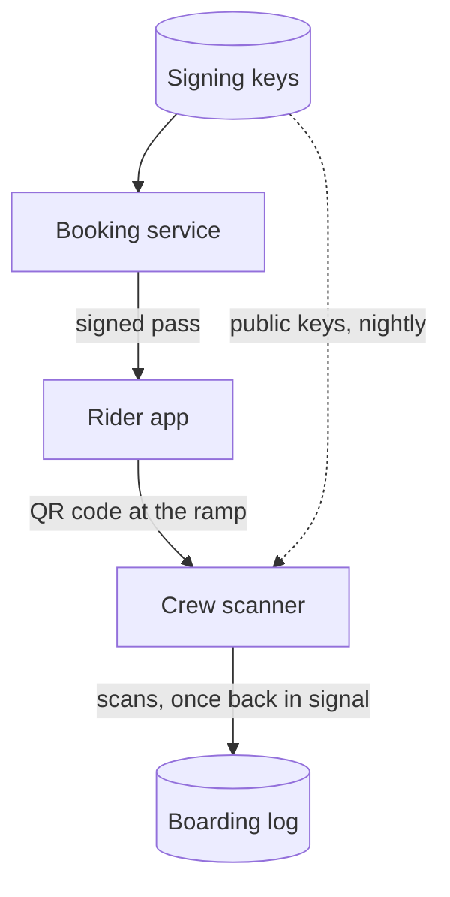

# Offline boarding passes

*Tidewright · Wenlow Islands ferries*

Boarding passes that scan with no signal at the Brisk slipway, in seven steps across three phases. Approve each step with go, revise, or skip.

**7** steps · **0** decided

2026-08-24 · for-approval

## Goal

Brisk harbour has no mobile signal at the slipway on most mornings. Passes that need the network fail at the ramp, and crew fall back to a paper list printed the night before, which misses every late booking.

The goal is a pass the crew scanner can check with no network at all, in place for the winter timetable on 26 October.

- **Offline for**: Up to eight hours, the first Brisk sailing to the last on a winter day.
- **Check time**: Under one second a pass on the oldest handheld the crews carry.
- **Copied passes**: Refused when scanned twice on one handheld, and flagged across handhelds once back in signal.
- **Out of scope**: Wallet passes, paper tickets, and any change to fares or refunds.

**How a pass is signed and checked**



## Phase 1: Sign passes

| # | Step | Effort | Status | Owner | Depends on |
| --- | --- | --- | --- | --- | --- |
| 1 | Add a pass signing key to the booking service | S | done | Tomas |  |
| 2 | Sign every pass at booking | M | doing | Mira | 1 |

*Effort is agent time, not calendar time: S is under an hour, M is a few hours with review, L is a day or more across sessions.*

### 1. Add a pass signing key to the booking service

done · Effort S · Owner Tomas

An Ed25519 key pair in the secrets store, rotated every 90 days, with the old key accepted for a week after.

#### What changes

A key pair lives in the secrets store under `pass-signing`. The booking service loads it at startup and publishes the public half at `/keys/pass.json`.

#### Done when

`curl -s localhost:8080/keys/pass.json | jq '.keys | length'` prints 2 during a rotation and 1 otherwise.

#### Risk

A leaked private key lets anyone mint passes. An early rotation revokes it within the hour, and the runbook has the steps.

### 2. Sign every pass at booking

doing · Effort M · Owner Mira · Depends on 1

Each pass carries its booking, sailing, party, and vehicle, signed, in a QR code the scanner reads in poor light.

#### What changes

The pass payload grows from a booking id to the fields below, signed and base45 encoded. Passes issued before the change work until they expire.

#### Touches

`booking/pass/issue.go`, the rider app's pass screen, and the confirmation email.

#### Done when

`go test ./booking/pass/...` passes, and a pass shown at 70% screen brightness scans on the oldest handheld.

#### Diff

```diff
-type Pass struct{ BookingID string }
+type Pass struct {
+	BookingID string    `json:"b"`
+	SailingID string    `json:"s"`
+	Party     int       `json:"p"`
+	Vehicle   string    `json:"v,omitempty"`
+	Expires   time.Time `json:"e"`
+}
```

## Phase 2: Scan offline

| # | Step | Effort | Status | Owner | Depends on |
| --- | --- | --- | --- | --- | --- |
| 3 | Keep the public keys on every scanner | S | planned | Joss | 1 |
| 4 | Check passes on the scanner with no network | M | planned | Mira | 2, 3 |
| 5 | Queue scans until the signal returns | M | planned | Joss | 4 |

*Effort is agent time, not calendar time: S is under an hour, M is a few hours with review, L is a day or more across sessions.*

### 3. Keep the public keys on every scanner

planned · Effort S · Owner Joss · Depends on 1

Scanners fetch the public keys whenever they have signal and keep the last two, so a rotation never strands a sailing.

#### What changes

The crew app fetches `/keys/pass.json` at launch and each night on harbour Wi-Fi, and stores the last two keys. The status bar shows how old they are.

#### Done when

With Wi-Fi off for 48 hours, a scanner still accepts passes signed before and after a rotation.

### 4. Check passes on the scanner with no network

planned · Effort M · Owner Mira · Depends on 2, 3

The scanner checks the signature, sailing, and expiry itself, and shows board or stop in under a second.

#### What changes

A scan checks the signature against the stored keys, then the sailing and expiry against the handheld's clock. The screen shows board in teal or stop in ochre, with the reason in words.

#### Why

Crew load forty cars in ten minutes at Brisk. Anything slower than a second a pass holds up the ramp.

#### Done when

`scanner-sim --offline 8h --passes testdata/brisk-week.json` reports every pass checked in under 1,000 ms.

#### Risk

A handheld with the wrong time refuses good passes. The scanner keeps the last server time it saw and warns crew when the clock drifts more than five minutes.

### 5. Queue scans until the signal returns

planned · Effort M · Owner Joss · Depends on 4

Scans wait on the handheld and upload when it reconnects, and a pass scanned twice is flagged to the office.

#### What changes

Each scan goes into a local queue with the pass and the time, and uploads in order on reconnect. The server flags any pass scanned twice for one sailing.

#### Done when

`scanner-sim --replay-duplicates testdata/copied-passes.json` flags both copies after the reconnect.

#### Note

A copy used on two handhelds on one sailing is only caught after upload. The harbour office agreed that is acceptable at Brisk.

## Phase 3: Roll out at Brisk

| # | Step | Effort | Status | Owner | Depends on |
| --- | --- | --- | --- | --- | --- |
| 6 | Trial on the Brisk crossings for a week | S | planned | Ines | 4, 5 |
| 7 | Retire the printed boarding list | S | blocked | Ines | 6 |

*Effort is agent time, not calendar time: S is under an hour, M is a few hours with review, L is a day or more across sessions.*

### 6. Trial on the Brisk crossings for a week

planned · Effort S · Owner Ines · Depends on 4, 5

Every Brisk crossing boards from the scanner for a week, with the paper list printed as a fallback.

#### What changes

For one week, crew scan every pass at the Brisk slipway and tick the paper list only when a scan fails. Ines logs every failure with its reason.

#### Done when

Fewer than one scan in a hundred falls back to the paper list, and no rider waits more than a minute at the ramp.

### 7. Retire the printed boarding list

blocked · Effort S · Owner Ines · Depends on 6

Stop printing the list the night before, once the harbour authority signs off on boarding from the scanner alone.

#### What changes

The nightly print job stops for Brisk, and the crew app keeps a read-only list for emergencies.

#### Done when

The harbour authority confirms in writing that scanner-only boarding meets its passenger count rules.

#### Risk

The authority wants a passenger count that survives a flat battery. Until it rules, each boat carries a charged spare handheld.

## Verification

The plan has worked when a full week of Brisk crossings boards from the scanner alone, and a copied pass is caught in the simulator and in the trial.

**Checks**

```sh
go test ./booking/pass/... ./scanner/...
scanner-sim --offline 8h --passes testdata/brisk-week.json
scanner-sim --replay-duplicates testdata/copied-passes.json
```

## How to approve

Say go, revise, or skip by step number. Numbers without a word mean go.

For example: `go all; revise 4; skip 7. Notes: 4: split the migration.`

No decisions yet.
